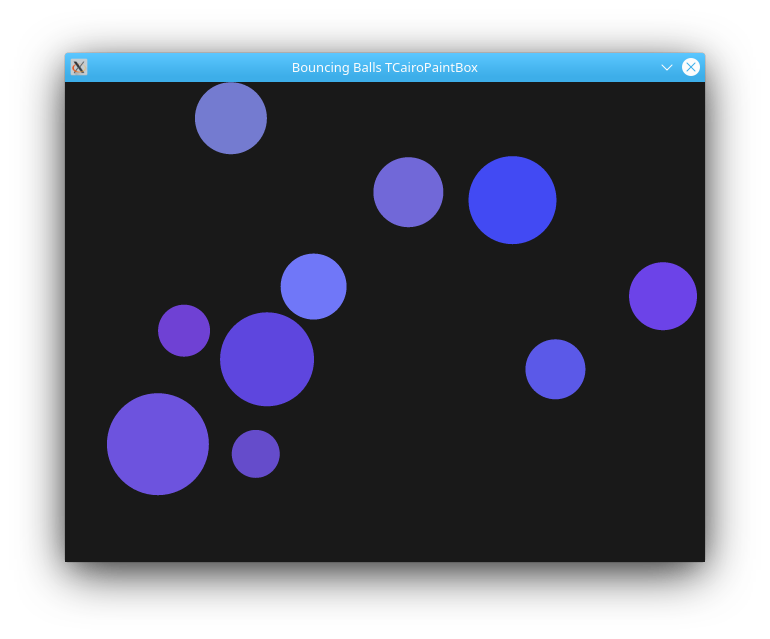

# Cairo Bouncing Balls

## Description

Bouncing balls for Lazarus, using *TCairoPaintBox* from [luipack](https://github.com/blikblum/luipack).

## Build

To install the *TCairoPaintBox* component in Lazarus, load [cairolcl_package.lpk](https://github.com/blikblum/luipack/blob/master/cairo/cairolcl_package.lpk).
  
## Authors

- Uwe Schächterle ([original program](https://corpsman.de/index.php?doc=beispiele/pingpong))
- Roland Chastain (Cairo version)

## Screenshot

